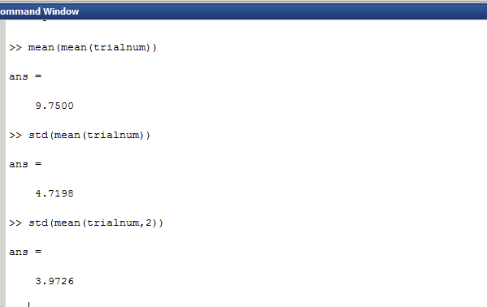
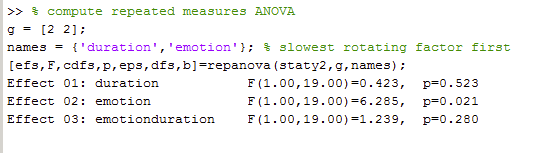
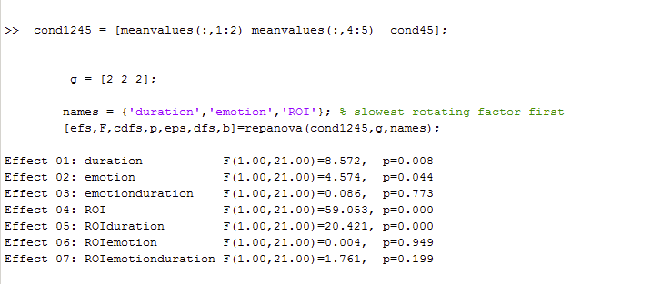

#### Article ID: bPJii
#### Pilot: Alicia Hofelich Mohr
#### Co-pilot: Mike Frank 
#### Start date: 04-28-2017
#### End date: 07-14-2017 
#### Updated: 12-18-2017 (AHM)
#### Final verification: Tom Hardwicke
#### Date: 03-13-2018

-------

#### Methods summary: 
Infants were presented with pictures of fearful and happy faces that were displayed subliminally (50ms; followed by a scrambled neutral face mask; then a neutral face for 900ms) or supraliminally (50ms; followed by a scrambled neutral face mask; then a face of the same emotion for 900ms). Eyetracking was used to measure pupil dilation across the whole trial and the duration of fixation on the second face. 

------

#### Target outcomes: 
> 3.1. Pupil diameter

> We observed a main effect of Emotion [F(1, 19) = 6.45, MSE = .0039, p = .02, η2 = .25], revealing a larger pupil diameter for happy compared to fearful facial expressions irrespective of presentation condition (Figs. 2A and 3). There was no main effect of Presentation Condition [F(1, 19) = 0.40, MSE = .0029, p = .53, η2 = .02] and no interaction between Presentation Condition and Emotion [F(1, 19) = 1.17, MSE = .0011, p = .29, η2 = .06].

> A control analysis excluding items from one actress displaying no teeth in the fearful condition (see Methods) and three participants yielded a similar pattern of results, although the main effect of emotion is only marginally significant in this case [F(1, 16) = 3.845, p = 0.068, η2 = .19]. The marginal effect is likely explained by reduced power because we had to exclude three additional infants from this analysis (n = 17 instead of n = 20 in the main analysis) in order to adhere to our inclusion criterion.

> 3.2. Fixation duration

> While the main focus of the study was clearly on the analysis of pupil size, we also compared differences in fixation duration to complement this analysis.

> As for pupil size, we observed a main effect of Emotion; infants showed a significantly longer fixation duration for happy compared to fearful facial expressions [F(1, 21) = 4.57, MSE = 0.015, p = .044, η2 = .19]. Furthermore, we found a main effect of Presentation Condition, showing that infants looked longer in the subliminal compared to the supraliminal condition [F(1, 21) = 8.57, MSE = 0.020, p = .008, η2 = .29] (see Fig. 2B). Note that in the subliminal conditions, a neutral face was presented during the time used for analyzing the fixation duration; hence, this effect can also be framed as a longer looking duration to neutral faces (as compared to emotional faces) preceded by subliminal emotional ones. An interaction between Presentation Condition and AOI [F(1, 21) = 20.42, MSE = 0.010, p < .001, η2 = .49] revealed that this was the case in particular for the eye region [t(21) = −4.06, p < .001, r = .66].

> Furthermore, we observed a main effect of AOI [F(1, 21) = 59.05, MSE = 0.073, p < .001, η2 = .74], showing that infants fixated longer on the eye than on the mouth AOI.

> There was no significant interaction between Emotion and Presentation Condition [F(1, 21) = 0.09, MSE = 0.007, p = .77, η2 = .004], AOI and Emotion [F(1, 21) = 0.004, MSE = 0.008, p = .95, η2 = .0002], or Emotion, Presentation Condition, and AOI [F(1, 21) = 1.76, MSE = 006, p = .20, η2 = .077].

> 3.3. Results of correlation analysis

> We did not observe a significant correlation between pupil diameter and fixation duration for the sum of both AOIs (p = .51, r = −.18), for the eye AOI (p = .31, r = −.27), or for the mouth AOI (p = .55, r = .16).

------

```{r global_options, include=FALSE}
knitr::opts_chunk$set(echo=TRUE, warning=FALSE, message=FALSE)

# prepare an empty report object, we will update this each time we run compareValues2()
reportObject <- data.frame("Article_ID" = NA, "valuesChecked" = 0, "eyeballs" = 0, "Total_df" = 0, "Total_p" = 0, "Total_mean" = 0, "Total_sd" = 0, "Total_se" = 0, "Total_ci" = 0, "Total_bf" = 0, "Total_t" = 0, "Total_F" = 0, "Total_es" = 0, "Total_median" = 0, "Total_irr" = 0, "Total_r" = 0, "Total_z" = 0, "Total_coeff" = 0, "Total_n" = 0, "Total_x2" = 0, "Total_other" = 0, "Insufficient_Information_Errors" = 0, "Decision_Errors" = 0, "Major_Numerical_Errors" = 0, "Minor_Numerical_Errors" = 0, "Major_df" = 0, "Major_p" = 0, "Major_mean" = 0, "Major_sd" = 0, "Major_se" = 0, "Major_ci" = 0, "Major_bf" = 0, "Major_t" = 0, "Major_F" = 0, "Major_es" = 0, "Major_median" = 0, "Major_irr" = 0, "Major_r" = 0, "Major_z" = 0, "Major_coeff" = 0, "Major_n" = 0, "Major_x2" = 0, "Major_other" = 0, "affectsConclusion" = NA, "error_typo" = 0, "error_specification" = 0, "error_analysis" = 0, "error_data" = 0, "error_unidentified" = 0, "Author_Assistance" = NA, "resolved_typo" = 0, "resolved_specification" = 0, "resolved_analysis" = 0, "resolved_data" = 0, "correctionSuggested" = NA, "correctionPublished" = NA)
```

## Step 1: Load packages

```{r}
library(tidyverse) # for data munging
library(knitr) # for kable table formating
library(haven) # import and export 'SPSS', 'Stata' and 'SAS' Files
library(readxl) # import excel files
library(CODreports) # custom report functions
library(reshape2) # for data munging
```

## Step 2. Attempt to reproduce target outcomes with provided Matlab code 

Our initial piloting attempt ran into difficulties because complex pre-processing steps were required (see Appendix). We contacted the original authors for assistance and they promptly provided Matlab scripts and some additional data. Using Matlab (R2017a), we attempted to follow the provided instructions to reproduce the analyses. 

Starting with the pupil_pupilsize_analysis.m. I saved my script as "pupil_pupilsize_analysis_AHM.m" so I could add edits to the code. There were instructions for manual preparation of the raw data (select columns, convert to text, replace commas with periods in numbers), but only the raw excel data was provided. 

I attempted to replicate this pre-processing in R (the code is not evaluated in the R markdown file as it takes a while to run):

```{r, eval = FALSE}
datafolder <- paste0(getwd(), "/authorAssistance/data/rawdata_pupil")

files <- grep("pupil", list.files(path=datafolder), value=T)

for (i in files){
  temp <- read_excel(path=paste(datafolder, i, sep="/"), col_types = "text")
  #select variables (based on matlab script comments)
  temp <- select(temp, RecordingTimestamp, MediaName, PupilLeft, PupilRight)
  #replace commas with periods
  commatoperiod <- function(x) {gsub(",", ".", as.character(x))}
  temp <- apply(temp, 2, commatoperiod)
  #write as tab separated text in "txt" folder
  write.table(temp, file=paste(datafolder, "txt", paste0(gsub("xlsx", "", i), "txt"), sep="/"), sep="\t", row.names = FALSE)
}

```

However, we couldn't get this processed data to be read in correctly by Matlab.

Nevertheless, it looks like we can start at the next section in that script using the pre-processed data in the "preproc_segments" folder. I commented out the preprocessing section. The segmented data folder was named something different in the Matlab script, so I adjusted the code to match, and the "statistics" section at the end. 

### Descriptive statistics

> In the final sample, infants contributed on average 9.7 trials per condition (SD = 3.9).

I updated the "pupil_pupilsize_analysis_AHM.m" script with the additional lines of code the author provided to capture and aggregate the trial numbers information. 

I had to add additional code to remove the neutral trials from the resulting matrix in order to get the correct values. Overall, I found only slight rounding errors. 



Although the author said in their responses they used the first calculation of std, based on my numbers, it looks like it actually was the second. 

```{r}
reportObject <- compareValues2(reportedValue = "9.7", obtainedValue = "9.75", valueType = 'mean')
reportObject <- compareValues2(reportedValue = "3.9", obtainedValue = "3.97", valueType = 'sd')
```

### Inferential statistics
> 3.1. Pupil diameter

> We observed a main effect of Emotion [F(1, 19) = 6.45, MSE = .0039, p = .02, η2 = .25], revealing a larger pupil diameter for happy compared to fearful facial expressions irrespective of presentation condition (Figs. 2A and 3). There was no main effect of Presentation Condition [F(1, 19) = 0.40, MSE = .0029, p = .53, η2 = .02] and no interaction between Presentation Condition and Emotion [F(1, 19) = 1.17, MSE = .0011, p = .29, η2 = .06].

They used the "repanova.m" and "smp_Fcdf.m" functions along with code from the pupil_analysis script to run the repeated measures ANOVA. 



The numbers are very close but not exactly what was reported:

```{r}
#Emotion main effect
reportObject <- compareValues2(reportedValue = "6.45", obtainedValue = "6.285", valueType = 'F')
reportObject <- compareValues2(reportedValue = "1", obtainedValue = "1", valueType = 'df')
reportObject <- compareValues2(reportedValue = "19", obtainedValue = "19", valueType = 'df')

#Duration main effect
reportObject <- compareValues2(reportedValue = "0.53", obtainedValue = "0.523", valueType = 'p')
reportObject <- compareValues2(reportedValue = "1", obtainedValue = "1", valueType = 'df')
reportObject <- compareValues2(reportedValue = "19", obtainedValue = "19", valueType = 'df')

#interaction
reportObject <- compareValues2(reportedValue = "1.17", obtainedValue = "1.239", valueType = 'F')
reportObject <- compareValues2(reportedValue = "0.28", obtainedValue = "0.29", valueType = 'p')
reportObject <- compareValues2(reportedValue = "1", obtainedValue = "1", valueType = 'df')
reportObject <- compareValues2(reportedValue = "19", obtainedValue = "19", valueType = 'df')
```

> A control analysis excluding items from one actress displaying no teeth in the fearful condition (see Methods) and three participants yielded a similar pattern of results, although the main effect of emotion is only marginally significant in this case [F(1, 16) = 3.845, p = 0.068, η2 = .19]. The marginal effect is likely explained by reduced power because we had to exclude three additional infants from this analysis (n = 17 instead of n = 20 in the main analysis) in order to adhere to our inclusion criterion.

There's no mention in the script, readme file, or article which face was removed from analysis, so there is insufficient information to replicate this portion. 

Update based on Jan 2018 email: The authors responded about the infants who were removed (which was in the paper), but it remains unclear which stimuli were removed (which corresponded to the actress who displayed no teeth in the fearful condition). If the logic for infant removal is built into the script (which it appeared to be for the initial analysis), we would just need the code to remove the relevant actress to reproduce this analysis. Additional author assistance has been requested but we've not had a response to this query (as of March 19, 2018).

Recording insufficient information error:

```{r}
reportObject$Insufficient_Information_Errors <- reportObject$Insufficient_Information_Errors + 1
```

> 3.2. Fixation duration

> While the main focus of the study was clearly on the analysis of pupil size, we also compared differences in fixation duration to complement this analysis.

For this analysis, I ran the pupil_fixation_analysis.m and the did_baby_look_during_subliminal.m files. I saved my changes as "pupil_fixation_analysis_AHMedits.m".

The script was organized such that several lines of code had to be re-run with different conditions specified (described in comments). I added a few sections to the code to be sure I ran it in the correct order, as objects were named the same and could easily be assigned to the wrong condition if the code was run out of order. 

I ran the script as follows:  

* Ran first two sections (lines 1-87) as is, changing directory information
* Ran supraliminal section with condition = 1 in line 93
* Copied and pasted the STORE values section for Happy into the command window (so the whole section would not run)
* Updated the condition = 2 in line 93 and re-ran subliminal section
* Copied and pasted the STORE values section for Fear into the command window (so the whole section would not run)
* Updated the condition = 3 in line 93 and re-ran subliminal section (neutral was referenced later in the script and removed before analysis, but I didn't want to break anything)
* Copied and pasted the STORE values section for Neutral into the command window (so the whole section would not run)
* Ran compute mean values section
* Ran the subliminal section starting at line 210, with condition = 4 in line 215. 
* Then ran did_baby_look_during_subliminal.m with condition = 4
* Ran section for eyes starting line 294
* Copied and pasted the STORE values for condition 4 in the command window. 
* Ran section for mouth starting at line 341
* Copied and pasted the STORE values for condition 4 in the command window.
* Ran the subliminal section at line 210 with condition = 5 in line 215
* Then ran did_baby_look_during_subliminal.m with condition = 5
* Ran section for eyes starting line 294
* Copied and pasted the STORE values for condition 5 in the command window. 
* Ran section for mouth starting at line 341
* Copied and pasted the STORE values for condition 5 in the command window. 
* Ran last two sections of script

Again, the last lines of code used repanova and spm_Fcdf scripts for analysis. 



> As for pupil size, we observed a main effect of Emotion; infants showed a significantly longer fixation duration for happy compared to fearful facial expressions [F(1, 21) = 4.57, MSE = 0.015, p = .044, η2 = .19]. Furthermore, we found a main effect of Presentation Condition, showing that infants looked longer in the subliminal compared to the supraliminal condition [F(1, 21) = 8.57, MSE = 0.020, p = .008, η2 = .29] (see Fig. 2B). Note that in the subliminal conditions, a neutral face was presented during the time used for analyzing the fixation duration; hence, this effect can also be framed as a longer looking duration to neutral faces (as compared to emotional faces) preceded by subliminal emotional ones. An interaction between Presentation Condition and AOI [F(1, 21) = 20.42, MSE = 0.010, p < .001, η2 = .49] revealed that this was the case in particular for the eye region [t(21) = −4.06, p < .001, r = .66].

All outcomes appear to match:

```{r}
# duration
reportObject <- compareValues2(reportedValue = "1", obtainedValue = "1", valueType = 'df')
reportObject <- compareValues2(reportedValue = "21", obtainedValue = "21", valueType = 'df')
reportObject <- compareValues2(reportedValue = "8.57", obtainedValue = "8.572", valueType = 'F')
reportObject <- compareValues2(reportedValue = ".008", obtainedValue = ".008", valueType = 'p')

# emotion
reportObject <- compareValues2(reportedValue = "1", obtainedValue = "1", valueType = 'df')
reportObject <- compareValues2(reportedValue = "21", obtainedValue = "21", valueType = 'df')
reportObject <- compareValues2(reportedValue = "4.57", obtainedValue = "4.574", valueType = 'F')
reportObject <- compareValues2(reportedValue = ".044", obtainedValue = ".044", valueType = 'p')

# emotion*duration
reportObject <- compareValues2(reportedValue = "1", obtainedValue = "1", valueType = 'df')
reportObject <- compareValues2(reportedValue = "21", obtainedValue = "21", valueType = 'df')
reportObject <- compareValues2(reportedValue = "20.42", obtainedValue = "20.421", valueType = 'F')
reportObject <- compareValues2(reportedValue = "eyeballMATCH", obtainedValue = "eyeballMATCH", valueType = 'p')
```

> Furthermore, we observed a main effect of AOI [F(1, 21) = 59.05, MSE = 0.073, p < .001, η2 = .74], showing that infants fixated longer on the eye than on the mouth AOI.

This matches.

```{r}
reportObject <- compareValues2(reportedValue = "1", obtainedValue = "1", valueType = 'df')
reportObject <- compareValues2(reportedValue = "21", obtainedValue = "21", valueType = 'df')
reportObject <- compareValues2(reportedValue = "59.05", obtainedValue = "59.053", valueType = 'F')
reportObject <- compareValues2(reportedValue = "eyeballMATCH", obtainedValue = "eyeballMATCH", valueType = 'p')
```

> There was no significant interaction between Emotion and Presentation Condition [F(1, 21) = 0.09, MSE = 0.007, p = .77, η2 = .004]...

```{r}
reportObject <- compareValues2(reportedValue = "1", obtainedValue = "1", valueType = 'df')
reportObject <- compareValues2(reportedValue = "21", obtainedValue = "21", valueType = 'df')
reportObject <- compareValues2(reportedValue = ".09", obtainedValue = ".086", valueType = 'F')
reportObject <- compareValues2(reportedValue = ".77", obtainedValue = ".773", valueType = 'p')
```

> ...AOI and Emotion [F(1, 21) = 0.004, MSE = 0.008, p = .95, η2 = .0002]... 

```{r}
reportObject <- compareValues2(reportedValue = "1", obtainedValue = "1", valueType = 'df')
reportObject <- compareValues2(reportedValue = "21", obtainedValue = "21", valueType = 'df')
reportObject <- compareValues2(reportedValue = ".004", obtainedValue = ".004", valueType = 'F')
reportObject <- compareValues2(reportedValue = ".95", obtainedValue = ".949", valueType = 'p')
```

> ...or Emotion, Presentation Condition, and AOI [F(1, 21) = 1.76, MSE = 006, p = .20, η2 = .077].

```{r}
reportObject <- compareValues2(reportedValue = "1", obtainedValue = "1", valueType = 'df')
reportObject <- compareValues2(reportedValue = "21", obtainedValue = "21", valueType = 'df')
reportObject <- compareValues2(reportedValue = "1.76", obtainedValue = "1.761", valueType = 'F')
reportObject <- compareValues2(reportedValue = ".20", obtainedValue = ".199", valueType = 'p')
```

> 3.3. Results of correlation analysis

> We did not observe a significant correlation between pupil diameter and fixation duration for the sum of both AOIs (p = .51, r = −.18), for the eye AOI (p = .31, r = −.27), or for the mouth AOI (p = .55, r = .16).

This analysis was not present in the Matlab script, nevertheless we attempted to run the analysis in R. I wrote out CSVs of each final matrix with mean values by condition and CSVs of the participants included. 

I initially used the "staty2" matrix from the pupil analysis, as that is what was used in their analysis in the matlab code. However, after trying the "staty" matrix instead (differs from staty2 in that staty2 is "divided by the mean to reduce within-subject variance"), it seems to produce more similar results. 

```{r}
fixation <- read.csv(file="authorAssistance/matlab scripts/meanfixationbycondition.csv", header=FALSE) #cond1245 in matlab code
pupil <- read.csv(file="authorAssistance/matlab scripts/meanpupilsizebycondition.csv", header=FALSE) #staty in matlab code 
fixationpartic <- read.csv(file="authorAssistance/matlab scripts/fixationparticipants.csv", header=FALSE) #participants in matlab code
pupilpartic <- as.data.frame(t(read.csv(file="authorAssistance/matlab scripts/pupilparticipants.csv", header=FALSE))) #participants in matlab code

#add column with participant number
fixation$ID <- fixationpartic$V1
pupil$ID <- pupilpartic$V1
```

From author's Jan 2018 email: "To be included in this analysis, an infant had to meet the inclusion criteria for both, the analysis of pupil size and the analysis of fixation duration. This was the case for 16 infants (participant numbers 3,6,10,11,12,13,16,17,18,19,20,21,22,23,24,29)."

The authors additionally said they used the "corrcoef" function in matlab, which can return the correlation coefficients and p values. Because they did not provide code to combine and average the values they described in Matlab, I will do so in R. The corr.test() function should be equivalent to the corcoef matlab function. 

First we need to remove ids of infants who did not fit the criteria:

```{r}
partstoinc <- c(3,6,10,11,12,13,16,17,18,19,20,21,22,23,24,29)
fixation <- filter(fixation, ID %in% partstoinc)
pupil <- filter(pupil, ID %in% partstoinc)
```

Based on the description of how these are set up, "first factor rotates slowest, last factor fastest" - I will rename columns:

```{r}
#names for pupil are c("duration", "emotion"), so D1E1 D1E2 D2E1 D2E2, I believe D1 is supraliminal, 2= subliminal, 1= happy, 2=fear, but it doesn't matter for this, as all values within participant will be averaged across. 
names(pupil) <- c("D1E1", "D1E2", "D2E1", "D2E2", "ID")

#for fixation, it is c("duration", "emotion", "ROI")
names(fixation) <- c("D1E1R1", "D1E1R2", "D1E2R1", "D1E2R2", "D2E1R1", "D2E1R2", "D2E2R1", "D2E2R2", "ID")
```

In the methods, it says this correlation was done "irrespective of condition". 

Update from email: "We then computed the average pupil size/ fixation duration across all 4 conditions (fear and happy, sub- und supraliminal) for these participants and computed a correlation between the pupil size and the summed fixation to both AOIs, the fixation to the eye AOI, and the fixation to the mouth AOI using the Matlab function corrcoef()."

From their description, it sounds like they created a single average score for each participant for the correlations, but it would be nice if the corrcoef function in Matlab also returned the number of points included in each correlation to be sure. 

Melt then aggregate pupil data:

```{r}
pupil.l <- melt(data=pupil, id = "ID", value.name = "pupil")
pupil.sum <- pupil.l %>% 
  group_by(ID) %>% 
  summarize(pupil = mean(pupil))
```

Subset fixation by ROI, then melt and aggregate:

```{r}
eye.l <- melt(data=select(fixation, ends_with("R1"), ID), id="ID", value.name = "eye")
eye.sum <- eye.l %>% 
  group_by(ID) %>% 
  summarize(eye = mean(eye))

mouth.l <- melt(data=select(fixation, ends_with("R2"), ID), id="ID", value.name="mouth")
mouth.sum <- mouth.l %>% 
  group_by(ID) %>% 
  summarize(mouth = mean(mouth))
```

Merge all three by ID:

```{r}
dataforcor <- merge(pupil.sum, eye.sum, by="ID")
dataforcor <- merge(dataforcor, mouth.sum, by="ID")

dataforcor$eyemouthsum <- rowSums(select(dataforcor, mouth, eye))
```

>  sum of both AOIs (p = .51, r = −.18),

```{r}
cor.out <- cor.test(dataforcor$pupil, dataforcor$eyemouthsum)
cor.out
```

This is much closer to what was reported in Matlab than my previous attempts, although there are still reproducibility errors:

```{r}
reportObject <- compareValues2(reportedValue = ".51", obtainedValue = cor.out$p.value, valueType = 'p')
reportObject <- compareValues2(reportedValue = "-.18", obtainedValue = cor.out$estimate[['cor']], valueType = 'r')
```

> for the eye AOI (p = .31, r = −.27), 

```{r}
cor.out <- cor.test(dataforcor$pupil, dataforcor$eye)
cor.out
```

Again, not quite a match, but much closer than what I had previously.  

```{r}
reportObject <- compareValues2(reportedValue = ".31", obtainedValue = cor.out$p.value, valueType = 'p')
reportObject <- compareValues2(reportedValue = "-.27", obtainedValue = cor.out$estimate[['cor']], valueType = 'r')
```

> or for the mouth AOI (p = .55, r = .16).

```{r}
cor.out <- cor.test(dataforcor$pupil, dataforcor$mouth)
cor.out
```

This one seems to match up ok:

```{r}
reportObject <- compareValues2(reportedValue = ".55", obtainedValue = cor.out$p.value, valueType = 'p')
reportObject <- compareValues2(reportedValue = ".16", obtainedValue = cor.out$estimate[['cor']], valueType = 'r')
```

## Step 3: Conclusion: 

We initally encountered considerable problems implementing the pre-processing steps necessary to get the raw data ready for analysis. There did not seem to be sufficient information provided in the article to implement these steps (see Appendix below). We contacted the authors for assistance and they promptly replied with some instructions, Matlab code, and already pre-processed data. We still couldn't get the preprocessing to work so instead we attempt to use the provided Matlab code and already pre-processed data to replicate the target outcomes.

Overall, the matlab code and additional data helped immensely, and we were able to approximate some of the target outcomes. However, there were still four major reproducibility errors. Additionally, some aspects of the analysis were not addressed in the provided code, such as the removal of one fearful actor and the correlations between pupil and fixation. We attempted to run the correlation analysis in R but did outcomes did not match up. Other details (such as which matrix was used in which analysis, or how many points were included in the correlation analyses) were also not included in the documentation (and the article) which made it tricky to figure out what the problem was.

Ultimately, despite helpful assistance from the original authors, some target outcomes were not reproducible. We did request additional assistance from the original authors but they did not respond to this query. Because we were unable to conduct some aspects of the analysis, we cannot be certain whether the reproducibility issues have substantial implications for the original conclusions.

```{r}
reportObject$Article_ID <- "bPJii"
reportObject$affectsConclusion <- "unclear"
reportObject$error_typo <- 0
reportObject$error_specification <- 3
reportObject$error_analysis <- 0
reportObject$error_data <- 0
reportObject$error_unidentified <- 0
reportObject$Author_Assistance <- T
reportObject$resolved_typo <- 0
reportObject$resolved_specification <- 1
reportObject$resolved_analysis <- 0
reportObject$resolved_data <- 0
reportObject$correctionSuggested <- "no"
reportObject$correctionPublished <- F

# decide on final outcome
if(reportObject$Decision_Errors > 0 | reportObject$Major_Numerical_Errors > 0 | reportObject$Insufficient_Information_Errors > 0){
  reportObject$finalOutcome <- "Failure"
  if(reportObject$Author_Assistance == T){
    reportObject$finalOutcome <- "Failure despite author assistance"
  }
}else{
  reportObject$finalOutcome <- "Success"
  if(reportObject$Author_Assistance == T){
    reportObject$finalOutcome <- "Success with author assistance"
  }
}

# save the report object
filename <- paste0("reportObject_", reportObject$Article_ID,".csv")
write_csv(reportObject, filename)
```

## Report Object

```{r, echo = FALSE}
# display report object in chunks
kable(reportObject[2:10], align = 'l')
kable(reportObject[11:20], align = 'l')
kable(reportObject[21:25], align = 'l')
kable(reportObject[26:30], align = 'l')
kable(reportObject[31:35], align = 'l')
kable(reportObject[36:40], align = 'l')
kable(reportObject[41:45], align = 'l')
kable(reportObject[46:51], align = 'l')
kable(reportObject[52:57], align = 'l')
```

## Session information

```{r session_info, include=TRUE, echo=TRUE, results='markup'}
devtools::session_info()
```

## Appendix: Initial piloting attempt

Data are in two files. data1.xlsx appears to be the fixation data for each participant by condition and area of interest (AOI), while data2.xlsx appears to be the raw pupil size data for each participant and by trial timestamp. Many sheets per file, with variable names across multiple rows. 

```{r, warning=FALSE}
data1sheets =  excel_sheets(path="data/data1.xlsx")

#read in the data for each sheet
for (i in data1sheets){
  #read in legend separately
  if (i == "legend") {
    data1legend = read_excel(path="data/data1.xlsx", sheet=which(data1sheets==i), col_names = FALSE)}
  else {
    temp = read_excel(path="data/data1.xlsx", sheet=which(data1sheets==i), skip=3, col_names = FALSE, col_types = "numeric")
    #put in column names
    tempnames = as.data.frame(t(read_excel(path="data/data1.xlsx", sheet=which(data1sheets==i), col_names = FALSE, col_types = "text")[1:3,]))
    tempnames = fill(tempnames, V1:V2)
    names(temp) = gsub(" |NA", "",  apply(tempnames, 1, paste, collapse="_"))
    assign(paste(i, sep=""), temp)
    }
}

data2sheets =  excel_sheets(path="data/data2.xlsx")
for (i in data2sheets){
  #read in legend separately
    temp = read_excel(path="data/data2.xlsx", sheet=which(data2sheets==i), col_names = TRUE, col_types = "text")
    assign(paste(i, sep=""), temp)
}

```


### Pre-processing

Because the raw data is given, all the preprocessing described in the article needs to be repeated. It said the analysis was done in MATLAB, but no script was included with the data submission. 

I initially tried to replicate the preprocessing based on the description in the article (which is presented below), but because the MATLAB script was not provided, a lot of assumptions had to be made. Here are some specific questions/information that would be needed to perform the pre-processing: 

1. The data provided is assumed to be the raw data collected by Tobii for eyetracking and pupil measurement, but is not the the correct format needed for analysis. The article mentions a MATLAB script that was used for preprocessing this data. Could the authors provide this script? 

2. There is no trial number or other variables about each trial in the pupil data files - the preprocessing done below is based on the time stamps and timing described in the article, but it is not specific enough to determine whether my division of trials are exactly the same as the authors'.

3. Each dataset does not contain the necessary variables for the analyses as described in the article. Condition, emotion, and trial had to be inserted based on the legend and by trying to interpret the numeric codes used in the media name (pupil data) and the tab/face codes in the fixation data. 

4. Exclusion criteria were explained in the article, but it was unclear what variables in which dataset were used to make the decisions. The number of excluded participants (and remaining trials per participant) I got in my preprocessing steps did not match the numbers reported.

5. Finally, because of the lack of information in the preprocessing and exclusion instructions, the degrees of freedom in the first analysis did not match the DoF reported in the results (F(1,19) reported versus F(1,21) found here). Instead of a numeric error, it's likely these errors all stem from a lack of information about the processing steps, given that only the raw data was provided. 


### Preprocessing and Steps that were completed

Code for each of the processing steps and analyses I attempted to complete is below. 

First, for pupil diameter - one raw file of the Tobii recording was given for each participant. Need to remove trials based on their logic, and then take pupil averages per trial, then per condition and participant. 

> Pupil diameter was recorded for both eyes separately, and if data was available for both eyes, the mean was computed. If a value was only available for one eye, this value was considered for further analysis (on average 15% of the data points). For analyzing the pupil size, the entire duration of one trial (i.e. 2300 ms) was considered (Fig. 1). A trial was excluded from further analysis if a value was recorded for less than 50% of the sampling points during this time. Additionally, a trial was excluded if the infant did not look at the section of the screen where the sub- liminal stimulus (face 1) was presented in the subliminal condi- tions to ensure that infants were able to process the stimuli (on an unconscious level). 

First, process each participants raw data file, then put all datafiles together. Assume each value in "MediaName" represents a new megablock, as described in the paper. Will put in a within-megablock timestamp, then add trial number based on the blocks being 2300ms. This will be messed up in the calibration blocks, but these will be discarded for analysis. 

```{r}
pupildata = grep("participant", ls(), value=T)
for (i in pupildata){
  #first remove skips between lines & non-trial recordings
  if (nrow(get(i)) > 5) {
    temp = get(i)
    temp = subset(temp, is.na(temp$MediaName)==FALSE)
    #put in megablock timestamp (restart timestamp for each medianame)
    temp$BlockTimestamp = NA
    for (k in levels(factor(temp$MediaName))) {
      temp$BlockTimestamp[which(temp$MediaName==k)] = as.numeric(temp$RecordingTimestamp[which(temp$MediaName==k)]) - as.numeric(temp$RecordingTimestamp[which(temp$MediaName==k)][1])
    }
    #insert trial number for each block, assuming 2300ms per trial
    temp$TrialNumber = floor((temp$BlockTimestamp/2300))+1
    
    #insert indicator for number of eyes with pupil measure for each sampling point
    temp$NEyes = ifelse(is.na(temp$PupilLeft)==FALSE & is.na(temp$PupilRight)==FALSE, 2, 
                        ifelse(is.na(temp$PupilLeft) & is.na(temp$PupilRight), 0, 1))
    #keep only relevant conditions (not ones that say "eyes"; nor the calibration or sounds)
    conditionstokeep = grep("happy|fear", levels(factor(temp$MediaName)), value=T)[-grep("eyes", grep("happy|fear", levels(factor(temp$MediaName)), value=T))]
    temp = subset(temp, temp$MediaName %in% conditionstokeep)
    #add column for participant
    temp$participant = i
    #saved as "analyzed" version of data
    assign(paste(i, "analyzed", sep="_"), temp)}
  else {}
}

#bind datafiles together
allpart = do.call(rbind, mget(grep("analyzed", ls(), value=T)))


#remove trials with fewer than 5 data points (relics of the time-stamp based trial number assignment - typically these are one or two sampling points at the end of a trial)
trialcounts <- allpart %>%
                  group_by(MediaName, participant, TrialNumber) %>%
                  summarize(count=n())
badtrials = paste(trialcounts$participant[which(trialcounts$count < 5)], trialcounts$MediaName[which(trialcounts$count < 5)], trialcounts$TrialNumber[which(trialcounts$count < 5)], sep="_")

```

Add columns based on Media name:

```{r}
#add column with emotion/condition (remove specifics of faces from MediaName)
allpart$trialtype = gsub("[[:digit:]]+|_down|_up|\\.avi", "", allpart$MediaName)

#add column with condition (supraliminal: emotion_emotion; or subliminal; emotion_neutral)
allpart$condition = factor(ifelse(allpart$trialtype=="fear_fear" | allpart$trialtype == "happy_happy", "supraliminal", ifelse(allpart$trialtype=="fear_neutral" | allpart$trialtype == "happy_neutral", "subliminal", NA)))
allpart$Emotion = factor(ifelse(allpart$trialtype=="fear_fear" | allpart$trialtype == "fear_neutral", "fear", ifelse(allpart$trialtype=="happy_happy" | allpart$trialtype == "happy_neutral", "happy", NA)))
allpart$Face1 <- factor(paste0("Face", gsub("[[:digit:]]{1}[[:alpha:]]+|_[[:alnum:]]+|\\.avi", "", allpart$MediaName)))


#create column with average pupil measure (ignoring NAs if only one eye is present)
allpart$PupilLeft = as.numeric(as.character(allpart$PupilLeft))
allpart$PupilRight = as.numeric(as.character(allpart$PupilRight))
allpart$PupilAvg = rowMeans(subset(allpart, select=c("PupilLeft", "PupilRight")), na=T)

#aggregate data to take pupil size means for each trial 
allpartag = allpart %>%
                group_by(MediaName, participant, TrialNumber, condition, Emotion) %>%
                summarize(PupilSize = mean(PupilAvg, na=T))


```

Now remove trials and participants based on logic described in article. 

> Pupil diameter was recorded for both eyes separately, and if data was available for both eyes, the mean was computed. If a value was only available for one eye, this value was considered for further analysis (on average 15% of the data points). 

```{r}
#create summary of how many trials had pupil data for 0, 1, or both eyes
eyecounts <- allpart %>%
                group_by(participant, MediaName, TrialNumber, NEyes) %>%
                summarize(count = n()) %>%
                spread(key=NEyes, value=count)
eyecounts$totalcount = rowSums(eyecounts[,c("0", "1", "2")], na.rm=T)
eyecounts$validcount = rowSums(eyecounts[,c("1", "2")], na.rm=T)

#how many data points only had one eye? 
mean(eyecounts$`1`/eyecounts$totalcount, na.rm=T) #out of all relevant trials
mean(eyecounts$`1`/eyecounts$validcount, na.rm=T) #out of all valid trials
```

The estimate of the percentage of one-eye trials among all relevant trials is a bit lower than reported. The percentage out of only valid trials, those with one or two eyes recorded, is higher.

```{r}
#compareValues(reportedValue = 15, obtainedValue = 11.9)
```

>  A trial was excluded from further analysis if a value was recorded for less than 50% of the sampling points during this time. 

```{r}
#create indicator to remove trials if less than 50% of the data points had data for one or more eye (more than 50% had 0)
eyecounts$removetrial = ifelse(eyecounts$`0`/eyecounts$totalcount > .5, 1, 0)
trialstoremove = paste(eyecounts[which(eyecounts$removetrial==1),]$participant, eyecounts[which(eyecounts$removetrial==1),]$MediaName, eyecounts[which(eyecounts$removetrial==1),]$TrialNumber, sep="_")

#remove these trials
allpart.rm1 <- subset(allpart, paste(allpart$participant, allpart$MediaName, allpart$TrialNumber, sep="_") %in% trialstoremove==FALSE)

```

> Additionally, a trial was excluded if the infant did not look at the section of the screen where the sub- liminal stimulus (face 1) was presented in the subliminal condi- tions to ensure that infants were able to process the stimuli (on an unconscious level). 

This requires looking at the fixation data for subliminal trials to determine if 
the participant made any fixations on the face during the trial. Need to look at total time on AOI during subliminal trials. 

First, need to combine all the subliminal fixation data (allAOI sum duration variable) into a single data set:
```{r}
combined = as.data.frame(matrix(ncol=8))
names(combined) = c("Participant", "stimuli","AllAOI","NotonAOI","tottime","file","trial","emotion")
for (i in grep("_sub", ls(), value=T)) {
  temp <- get(i)
  #select only the sum of time spend on and not on AOI (all time on stimlus)
  temp <- subset(temp, select=c("__Participant", grep("AOI_Sum", names(temp), value=T)))
  names(temp) <- gsub("__", "", names(temp))
  #reshape to long
  templ <- gather(temp, stimuli, time, -Participant)
  #create variable for location
  templ$location <- factor(gsub("Face[[:digit:]]{2,3}_|_Sum", "", templ$stimuli))
  templ$stimuli <- factor(gsub("_NotonAOI_Sum|_AllAOI_Sum", "", templ$stimuli))
  #spread time based on location 
  tempw <- spread(templ, key = location, value=time)
  tempw$tottime <- rowSums(tempw[,c("AllAOI", "NotonAOI")])
  tempw$file <- i
  tempw$trial <- factor(gsub("face", "", gsub("cond[[:digit:]]+_|_sub", "", tempw$file)))
  tempw$emotion <- ifelse(gsub("_face[[:digit:]]+_sub", "", tempw$file) == "cond4", "happy", ifelse(gsub("_face[[:digit:]]+_sub", "", tempw$file) == "cond5", "fear", NA))
  combined <- rbind(combined, tempw) 
  }

summary(combined)

```

Need to combine with pupil data in order to eliminate trials where the infant did not look at the screen. 

```{r}
#remove "participant" from number in pupil data
allpart.rm1$participant <- gsub("participant", "", allpart.rm1$participant)

#only combine the subliminal trials
sublimpupil <- subset(allpart.rm1, allpart.rm1$condition == "subliminal")
#check overlap

summary(paste0(sublimpupil$participant, sublimpupil$Face1, sublimpupil$TrialNumber, sublimpupil$Emotion) %in% paste0(combined$Participant, combined$stimuli, combined$trial, combined$emotion))

sublimpupilcombined <- merge(sublimpupil, combined, by.x = c("participant", "Face1", "TrialNumber", "Emotion"), by.y=c("Participant", "stimuli", "trial", "emotion"))

```

Sum total fixations over trials and exclude any trials that have 0 total fixation time. 

```{r}
totsublimfixtime <- 
  sublimpupilcombined %>%
  group_by(TrialNumber, participant, Emotion) %>%
  summarize(totaltime=sum(tottime))

notlooking <- 
  totsublimfixtime %>%
  filter(totaltime==0) %>%
  mutate(parttrial = paste(participant, Emotion, TrialNumber, sep="_"))

allpart.rm2 <- subset(allpart.rm1, paste(allpart.rm1$participant, allpart.rm1$Emotion, allpart.rm1$TrialNumber, allpart.rm1$condition, sep="_") %in% paste(notlooking$parttrial, "subliminal", sep="_")==FALSE)
```

Now aggregate data to determine how many trials each participant contributed per condition. It is unclear whether "condition" strictly means subliminal/supraliminal, or also includes emotion. 

```{r}
#aggregate data to take pupil size means for each trial 
allpart.rmag = allpart.rm2 %>%
                group_by(participant, TrialNumber, condition, Emotion) %>%
                summarize(PupilSize = mean(PupilAvg, na.rm=T))

#count number of trials per condition for each infant
numtrials = allpart.rmag %>%
              group_by(participant, condition) %>%
              summarize(ntrials = n()) %>%
              ungroup() %>%
              complete(participant,condition, fill=list(ntrials=0))


#remove infants who do not have at least one trial in each condition. 
kable(filter(numtrials, ntrials==0))
parttorm <- unique(filter(numtrials, ntrials==0)$participant)
```

> Only infants with at least one trial per con- dition following these criteria were included in the final analysis.

There were `r length(parttorm)` participants who needed to be removed.

```{r}
allpart.rmag = subset(allpart.rmag, allpart.rmag$participant %in% parttorm==FALSE)

#count number of trials per condition for each infant
summarytrials <-
  allpart.rmag %>%
  group_by(participant, condition) %>%
  summarize(ntrials = n()) %>%
  ungroup() %>%
  summarize(Mean = mean(ntrials), SD = sd(ntrials))
```

> For statistical analysis, the mean pupil diameter over the entire trial duration was computed. These values were averaged separately for every participant and condition and divided by the over- all mean pupil size of that participant to account for possible interindividual differences.

```{r}
pupildata = allpart.rmag %>%
            group_by(participant, condition, Emotion) %>%
            summarize(AvgPupilSize = mean(PupilSize, na.rm=T))

#divide by participant's mean pupil size
pupildata$relPupilSize = NA
for (i in 1:nrow(pupildata)) {
  pupildata$relPupilSize[i] = pupildata$AvgPupilSize[i]/mean(pupildata$AvgPupilSize[which(pupildata$participant == pupildata$participant[i])])
} 
```

