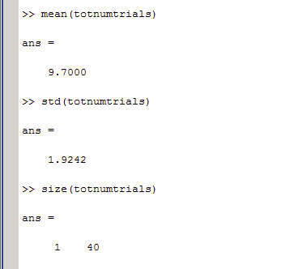

#### Article ID: bPJii
#### Pilot: Alicia Hofelich Mohr
#### Co-pilot: Mike Frank 
#### Start date: 04-28-2017
#### End date: 07-14-2017 
#### Updated: 12-18-2017

-------

#### Methods summary: 
Infants were presented with pictures of fearful and happy faces that were displayed subliminally (50ms; followed by a scrambled neutral face mask; then a neutral face for 900ms) or supraliminally (50ms; followed by a scrambled neutral face mask; then a face of the same emotion for 900ms). Eyetracking was used to measure pupil dilation across the whole trial and the duration of fixation on the second face. 

------

#### Target outcomes: 
> 3.1. Pupil diameter

> We observed a main effect of Emotion [F(1, 19) = 6.45, MSE = .0039, p = .02, η2 = .25], revealing a larger pupil diameter for happy compared to fearful facial expressions irrespective of presentation condition (Figs. 2A and 3). There was no main effect of Presentation Condition [F(1, 19) = 0.40, MSE = .0029, p = .53, η2 = .02] and no interaction between Presentation Condition and Emotion [F(1, 19) = 1.17, MSE = .0011, p = .29, η2 = .06].

> A control analysis excluding items from one actress displaying no teeth in the fearful condition (see Methods) and three participants yielded a similar pattern of results, although the main effect of emotion is only marginally significant in this case [F(1, 16) = 3.845, p = 0.068, η2 = .19]. The marginal effect is likely explained by reduced power because we had to exclude three additional infants from this analysis (n = 17 instead of n = 20 in the main analysis) in order to adhere to our inclusion criterion.

> 3.2. Fixation duration

> While the main focus of the study was clearly on the analysis of pupil size, we also compared differences in fixation duration to complement this analysis.

> As for pupil size, we observed a main effect of Emotion; infants showed a significantly longer fixation duration for happy compared to fearful facial expressions [F(1, 21) = 4.57, MSE = 0.015, p = .044, η2 = .19]. Furthermore, we found a main effect of Presentation Condition, showing that infants looked longer in the subliminal compared to the supraliminal condition [F(1, 21) = 8.57, MSE = 0.020, p = .008, η2 = .29] (see Fig. 2B). Note that in the subliminal conditions, a neutral face was presented during the time used for analyzing the fixation duration; hence, this effect can also be framed as a longer looking duration to neutral faces (as compared to emotional faces) preceded by subliminal emotional ones. An interaction between Presentation Condition and AOI [F(1, 21) = 20.42, MSE = 0.010, p < .001, η2 = .49] revealed that this was the case in particular for the eye region [t(21) = −4.06, p < .001, r = .66].

> Furthermore, we observed a main effect of AOI [F(1, 21) = 59.05, MSE = 0.073, p < .001, η2 = .74], showing that infants fixated longer on the eye than on the mouth AOI.

> There was no significant interaction between Emotion and Presentation Condition [F(1, 21) = 0.09, MSE = 0.007, p = .77, η2 = .004], AOI and Emotion [F(1, 21) = 0.004, MSE = 0.008, p = .95, η2 = .0002], or Emotion, Presentation Condition, and AOI [F(1, 21) = 1.76, MSE = 006, p = .20, η2 = .077].

> 3.3. Results of correlation analysis

> We did not observe a significant correlation between pupil diameter and fixation duration for the sum of both AOIs (p = .51, r = −.18), for the eye AOI (p = .31, r = −.27), or for the mouth AOI (p = .55, r = .16).


------


```{r global_options, include=FALSE}
knitr::opts_chunk$set(echo=TRUE, warning=FALSE, message=FALSE)
```


## Step 1: Load packages


```{r}
library(tidyverse) # for data munging
library(knitr) # for kable table formating
library(haven) # import and export 'SPSS', 'Stata' and 'SAS' Files
library(readxl) # import excel files
library(CODreports) # custom report functions
library(reshape2)
```

## Step 2. Replicating with sent Matlab codes 

The authors provided the matlab scripts for this study along with the raw data. Using Matlab (R2017a), I followed instructions to replicate their analyses. 

Started with the pupil_pupilsize_analysis.m. I saved my script as "pupil_pupilsize_analysis_AHM.m" so I could add edits to the code. There were instructions for manual preparation of the raw data (select columns, convert to text, replace commas with periods in numbers), but only the raw excel data was provided. 

I attempted to replicate this pre-processing in R (code is not evaluated in R markdown file; takes a while to run):
```{r, eval = FALSE}
datafolder <- paste0(getwd(), "/authorAssistance/data/rawdata_pupil")

files <- grep("pupil", list.files(path=datafolder), value=T)

for (i in files){
  temp <- read_excel(path=paste(datafolder, i, sep="/"), col_types = "text")
  #select variables (based on matlab script comments)
  temp <- select(temp, RecordingTimestamp, MediaName, PupilLeft, PupilRight)
  #replace commas with periods
  commatoperiod <- function(x) {gsub(",", ".", as.character(x))}
  temp <- apply(temp, 2, commatoperiod)
  #write as tab separated text in "txt" folder
  write.table(temp, file=paste(datafolder, "txt", paste0(gsub("xlsx", "", i), "txt"), sep="/"), sep="\t", row.names = FALSE)
}

```

I couldn't get the preprocessing to work (my processed data wasn't being read in correctly by Matlab). 

But it looks like we can start at the next section in that script using the processed data in the "preproc_segments" folder. I commented out the preprocessing section. The segmented data folder was named something different in the matlab script, so I adjusted the code to match, and the "statistics" section to the end to the end. 

### Descriptive statistics

> In the final sample, infants contributed on average 9.7 trials per condition (SD = 3.9).

I did not see this statistic anywhere in the script, but did see that in the analysis loop, trial was used for each participant. I added code to capture the number of trials for each participant and compiled them into a single array. 

I then took the mean and standard deviation of that array. The picture of the output from running the commands in the console is included below:


The numbers here are still different than what was reported. Both the mean number of trials and the SD were lower than reported. However, it was unclear from the paper whether condition meant condition as described in the code, or just supraliminal/subliminal (without emotion). 

To determine whether this was the case, I summed the supraliminal and subliminal and then took the mean and standard deviations. This resulted in the same mean as reported, but a lower standard deviation.  




```{r}
compareValues(reportedValue = 3.9, obtainedValue = 1.9)
```

### Inferential statistics
> 3.1. Pupil diameter

> We observed a main effect of Emotion [F(1, 19) = 6.45, MSE = .0039, p = .02, η2 = .25], revealing a larger pupil diameter for happy compared to fearful facial expressions irrespective of presentation condition (Figs. 2A and 3). There was no main effect of Presentation Condition [F(1, 19) = 0.40, MSE = .0029, p = .53, η2 = .02] and no interaction between Presentation Condition and Emotion [F(1, 19) = 1.17, MSE = .0011, p = .29, η2 = .06].

They used the "repanova.m" and "smp_Fcdf.m" functions along with code from the pupil_analysis script to run the repeated measures ANOVA. 


The numbers are very close but not exactly what was reported. I also do not know how to calculate the MSE and eta squared from their code. 

```{r}
#Emotion main effect
compareValues(reportedValue = 6.45, obtainedValue = 6.285)

#Duration main effect
compareValues(reportedValue = 0.53, obtainedValue = 0.523, isP=TRUE)

#interaction
compareValues(reportedValue = 1.17, obtainedValue = 1.239)
compareValues(reportedValue = 0.28, obtainedValue = 0.29, isP=TRUE)
```


> A control analysis excluding items from one actress displaying no teeth in the fearful condition (see Methods) and three participants yielded a similar pattern of results, although the main effect of emotion is only marginally significant in this case [F(1, 16) = 3.845, p = 0.068, η2 = .19]. The marginal effect is likely explained by reduced power because we had to exclude three additional infants from this analysis (n = 17 instead of n = 20 in the main analysis) in order to adhere to our inclusion criterion.

There's no mention in the script, readme file, or article which face was removed from analysis, so there is insufficient information to replicate this portion. 


> 3.2. Fixation duration

> While the main focus of the study was clearly on the analysis of pupil size, we also compared differences in fixation duration to complement this analysis.

For this analysis, ran the pupil_fixation_analysis.m and the did_baby_look_during_subliminal.m. I saved my changes as " pupil_fixation_analysis_AHMedits.m".

The script was organized such that several lines of code had to be re-run with different conditions specified (described in comments). I added a few sections to the code to be sure I ran it in the correct order, as objects were named the same and could easily be assigned to the wrong condition if the code was run out of order. 

I ran the script as follows:  

* Ran first two sections (lines 1-87) as is, changing directory information
* Ran supraliminal section with condition = 1 in line 93
* Copied and pasted the STORE values section for Happy into the command window (so the whole section would not run)
* Updated the condition = 2 in line 93 and re-ran subliminal section
* Copied and pasted the STORE values section for Fear into the command window (so the whole section would not run)
* Updated the condition = 3 in line 93 and re-ran subliminal section (neutral was referenced later in the script and removed before analysis, but I didn't want to break anything)
* Copied and pasted the STORE values section for Neutral into the command window (so the whole section would not run)
* Ran compute mean values section
* Ran the subliminal section starting at line 210, with condition = 4 in line 215. 
* Then ran did_baby_look_during_subliminal.m with condition = 4
* Ran section for eyes starting line 294
* Copied and pasted the STORE values for condition 4 in the command window. 
* Ran section for mouth starting at line 341
* Copied and pasted the STORE values for condition 4 in the command window.
* Ran the subliminal section at line 210 with condition = 5 in line 215
* Then ran did_baby_look_during_subliminal.m with condition = 5
* Ran section for eyes starting line 294
* Copied and pasted the STORE values for condition 5 in the command window. 
* Ran section for mouth starting at line 341
* Copied and pasted the STORE values for condition 5 in the command window. 
* Ran last two sections of script

Again, the last lines of code used repanova and spm_Fcdf scripts for analysis. 


> As for pupil size, we observed a main effect of Emotion; infants showed a significantly longer fixation duration for happy compared to fearful facial expressions [F(1, 21) = 4.57, MSE = 0.015, p = .044, η2 = .19]. Furthermore, we found a main effect of Presentation Condition, showing that infants looked longer in the subliminal compared to the supraliminal condition [F(1, 21) = 8.57, MSE = 0.020, p = .008, η2 = .29] (see Fig. 2B). Note that in the subliminal conditions, a neutral face was presented during the time used for analyzing the fixation duration; hence, this effect can also be framed as a longer looking duration to neutral faces (as compared to emotional faces) preceded by subliminal emotional ones. An interaction between Presentation Condition and AOI [F(1, 21) = 20.42, MSE = 0.010, p < .001, η2 = .49] revealed that this was the case in particular for the eye region [t(21) = −4.06, p < .001, r = .66].

These results all match the output (however again I am not sure how to calculate the other scores from their data)


> Furthermore, we observed a main effect of AOI [F(1, 21) = 59.05, MSE = 0.073, p < .001, η2 = .74], showing that infants fixated longer on the eye than on the mouth AOI.

This matches. 

> There was no significant interaction between Emotion and Presentation Condition [F(1, 21) = 0.09, MSE = 0.007, p = .77, η2 = .004], AOI and Emotion [F(1, 21) = 0.004, MSE = 0.008, p = .95, η2 = .0002], or Emotion, Presentation Condition, and AOI [F(1, 21) = 1.76, MSE = 006, p = .20, η2 = .077].

This also matches. 


> 3.3. Results of correlation analysis

> We did not observe a significant correlation between pupil diameter and fixation duration for the sum of both AOIs (p = .51, r = −.18), for the eye AOI (p = .31, r = −.27), or for the mouth AOI (p = .55, r = .16).

This analysis was not present in the matlab script, and it isn't clear how many points were included in each correlation. To test, I wrote out CSVs of each final matrix with mean values by condition and CSVs of the participants included. 

```{r}
fixation <- read.csv(file="authorAssistance/matlab scripts/meanfixationbycondition.csv", header=FALSE)
pupil <- read.csv(file="authorAssistance/matlab scripts/meanpupilsizebycondition.csv", header=FALSE)
fixationpartic <- read.csv(file="authorAssistance/matlab scripts/fixationparticipants.csv", header=FALSE)
pupilpartic <- as.data.frame(t(read.csv(file="authorAssistance/matlab scripts/pupilparticipants.csv", header=FALSE)))

#add column with participant number
fixation$ID <- fixationpartic$V1
pupil$ID <- pupilpartic$V1

```

Based on the description of how these are set up, "first factor rotates slowest, last factor fastest" - will rename columns:
```{r}
#names for pupil are c("duration", "emotion"), so D1E1 D1E2 D2E1 D2E2, I believe D1 is supraliminal, 2= subliminal, 1= happy, 2=fear, but it doesn't matter for this. 
names(pupil) <- c("D1E1", "D1E2", "D2E1", "D2E2", "ID")

#for fixation, it is c("duration", "emotion", "ROI")
names(fixation) <- c("D1E1R1", "D1E1R2", "D1E2R1", "D1E2R2", "D2E1R1", "D2E1R2", "D2E2R1", "D2E2R2", "ID")
```

In the methods, it says this correlation was done "irrespective of condition", so perhaps they took the averages across conditions?

Melt then aggregate pupil data:
```{r}
pupil.l <- melt(data=pupil, id = "ID", value.name = "pupil")
pupil.sum <- pupil.l %>% 
  group_by(ID) %>% 
  summarize(pupil = mean(pupil))
```

Subset fixation by ROI, then melt and aggregate:
```{r}
eye.l <- melt(data=select(fixation, ends_with("R1"), ID), id="ID", value.name = "eye")
eye.sum <- eye.l %>% 
  group_by(ID) %>% 
  summarize(eye = mean(eye))

mouth.l <- melt(data=select(fixation, ends_with("R2"), ID), id="ID", value.name="mouth")
mouth.sum <- mouth.l %>% 
  group_by(ID) %>% 
  summarize(mouth = mean(mouth))
```

Merge all three by ID
```{r}
dataforcor <- merge(pupil.sum, eye.sum, by="ID")
dataforcor <- merge(dataforcor, mouth.sum, by="ID")

dataforcor$eyemouthsum <- rowSums(select(dataforcor, mouth, eye))
```

>  sum of both AOIs (p = .51, r = −.18),

```{r}
cor.test(dataforcor$pupil, dataforcor$eyemouthsum)
```

This does not match what was reported, but likely due to insufficient information about what points they used. I am commenting out these functions, as insufficient information errors seem to be more fitting. 

```{r}
#compareValues(reportedValue = .51, obtainedValue = .1357, isP=TRUE)
#compareValues(reportedValue = -.18, obtainedValue = .389)
```


> for the eye AOI (p = .31, r = −.27), 


```{r}
cor.test(dataforcor$pupil, dataforcor$eye)
```


This does not match what was reported, and I'm taking the same tactic as above. 

```{r}
#compareValues(reportedValue = .31, obtainedValue = .62, isP=TRUE)
#compareValues(reportedValue = -.27, obtainedValue = .13)
```

> or for the mouth AOI (p = .55, r = .16).


```{r}
cor.test(dataforcor$pupil, dataforcor$mouth)
```

Same as above.  

```{r}
#compareValues(reportedValue = .55, obtainedValue = .018, isP=TRUE)
#compareValues(reportedValue = .16, obtainedValue = .58)
```


## Step 3: Conclusion: 

Overall, the matlab codes and additional data helped immensely with my ability to replicate the author's findings. Everything that was specified within the matlab codes replicated with only very minor descrepencies (except for the descriptive statistics, which were not in the original code). 

However, I found insufficient information to replicate analyses that were not present in the code, such as the removal of one fearful actor and the correlations between pupil and fixation (what I tried based on what was there was way off). I found the matlab code and data as they shared with us immensely more helpful than the two excel sheets, and it would have been nice if that was what they had shared with the paper. 

I am counting each of the correlations separately as insufficient information errors, but because they depend on the same information, it may make sense to count as a single error, in which case there would be two instead of four. 

```{r}
codReport(Report_Type = 'pilot',
          Article_ID = 'bPJii', 
          Insufficient_Information_Errors = 4,
          Decision_Errors = 0, 
          Major_Numerical_Errors = 1, 
          Minor_Numerical_Errors = 4)
```


```{r session_info, include=TRUE, echo=TRUE, results='markup'}
devtools::session_info()
```


## Appendix: Initial piloting attempt

Data are in two files. data1.xlsx appears to be the fixation data for each participant by condition and area of interest (AOI), while data2.xlsx appears to be the raw pupil size data for each participant and by trial timestamp. Many sheets per file, with variable names across multiple rows. 

```{r, warning=FALSE}
data1sheets =  excel_sheets(path="data/data1.xlsx")

#read in the data for each sheet
for (i in data1sheets){
  #read in legend separately
  if (i == "legend") {
    data1legend = read_excel(path="data/data1.xlsx", sheet=which(data1sheets==i), col_names = FALSE)}
  else {
    temp = read_excel(path="data/data1.xlsx", sheet=which(data1sheets==i), skip=3, col_names = FALSE, col_types = "numeric")
    #put in column names
    tempnames = as.data.frame(t(read_excel(path="data/data1.xlsx", sheet=which(data1sheets==i), col_names = FALSE, col_types = "text")[1:3,]))
    tempnames = fill(tempnames, V1:V2)
    names(temp) = gsub(" |NA", "",  apply(tempnames, 1, paste, collapse="_"))
    assign(paste(i, sep=""), temp)
    }
}

data2sheets =  excel_sheets(path="data/data2.xlsx")
for (i in data2sheets){
  #read in legend separately
    temp = read_excel(path="data/data2.xlsx", sheet=which(data2sheets==i), col_names = TRUE, col_types = "text")
    assign(paste(i, sep=""), temp)
}

```


### Pre-processing

Because the raw data is given, all the preprocessing described in the article needs to be repeated. It said the analysis was done in MATLAB, but sadly no script was included with the data submission. 

I initially tried to replicate the preprocessing based on the description in the article (which is presented below), but because the MATLAB article was not provided, there were a lot of assumptions that had to be made. Here are some specific questions/information that would be needed: 

1. The data provided is assumed to be the raw data collected by Tobii for eyetracking and pupil measurement, but is not the the correct format needed for analysis. The article mentions a MATLAB script that was used for preprocessing this data. Could the authors provide this script? 
2. There is no trial number or other variables about each trial in the pupil data files - the preprocessing done below is based on the time stamps and timing described in the article, but it is not specific enough to determine whether my division of trials are exactly the same as the authors'. 
3. Each dataset does not contain the necessary variables for the analyses as described in the article. Condition, emotion, and trial had to be inserted based on the legend and by trying to interpret the numeric codes used in the media name (pupil data) and the tab/face codes in the fixation data. 
4. Exclusion criteria were explained in the article, but it was unclear what variables in which dataset were used to make the decisions. The number of excluded participants (and remaining trials per participant) I got in my preprocessing steps did not match the numbers reported.
5. Finally, because of the lack of information in the preprocessing and exclusion instructions, the degrees of freedom in the first analysis did not match the DoF reported in the results (F(1,19) reported versus F(1,21) found here). Instead of a numeric error, it's likely these errors all stem from a lack of information about the processing steps, given that only the raw data was provided. 


### Preprocessing and Steps that were complete

Code for each of the processing steps and analyses I attempted to complete is below. 

First, for pupil diameter - one raw file of the Tobii recording was given for each participant. Need to remove trials based on their logic, and then take pupil averages per trial, then per condition and participant. 

> Pupil diameter was recorded for both eyes separately, and if data was available for both eyes, the mean was computed. If a value was only available for one eye, this value was considered for further analysis (on average 15% of the data points). For analyzing the pupil size, the entire duration of one trial (i.e. 2300 ms) was considered (Fig. 1). A trial was excluded from further analysis if a value was recorded for less than 50% of the sampling points during this time. Additionally, a trial was excluded if the infant did not look at the section of the screen where the sub- liminal stimulus (face 1) was presented in the subliminal condi- tions to ensure that infants were able to process the stimuli (on an unconscious level). 

First, process each participants raw data file, then put all datafiles together. Assume each value in "MediaName" represents a new megablock, as described in the paper. Will put in a within-megablock timestamp, then add trial number based on the blocks being 2300ms. This will be messed up in the calibration blocks, but these will be discarded for analysis. 
```{r}
pupildata = grep("participant", ls(), value=T)
for (i in pupildata){
  #first remove skips between lines & non-trial recordings
  if (nrow(get(i)) > 5) {
    temp = get(i)
    temp = subset(temp, is.na(temp$MediaName)==FALSE)
    #put in megablock timestamp (restart timestamp for each medianame)
    temp$BlockTimestamp = NA
    for (k in levels(factor(temp$MediaName))) {
      temp$BlockTimestamp[which(temp$MediaName==k)] = as.numeric(temp$RecordingTimestamp[which(temp$MediaName==k)]) - as.numeric(temp$RecordingTimestamp[which(temp$MediaName==k)][1])
    }
    #insert trial number for each block, assuming 2300ms per trial
    temp$TrialNumber = floor((temp$BlockTimestamp/2300))+1
    
    #insert indicator for number of eyes with pupil measure for each sampling point
    temp$NEyes = ifelse(is.na(temp$PupilLeft)==FALSE & is.na(temp$PupilRight)==FALSE, 2, 
                        ifelse(is.na(temp$PupilLeft) & is.na(temp$PupilRight), 0, 1))
    #keep only relevant conditions (not ones that say "eyes"; nor the calibration or sounds)
    conditionstokeep = grep("happy|fear", levels(factor(temp$MediaName)), value=T)[-grep("eyes", grep("happy|fear", levels(factor(temp$MediaName)), value=T))]
    temp = subset(temp, temp$MediaName %in% conditionstokeep)
    #add column for participant
    temp$participant = i
    #saved as "analyzed" version of data
    assign(paste(i, "analyzed", sep="_"), temp)}
  else {}
}

#bind datafiles together
allpart = do.call(rbind, mget(grep("analyzed", ls(), value=T)))


#remove trials with fewer than 5 data points (relics of the time-stamp based trial number assignment - typically these are one or two sampling points at the end of a trial)
trialcounts <- allpart %>%
                  group_by(MediaName, participant, TrialNumber) %>%
                  summarize(count=n())
badtrials = paste(trialcounts$participant[which(trialcounts$count < 5)], trialcounts$MediaName[which(trialcounts$count < 5)], trialcounts$TrialNumber[which(trialcounts$count < 5)], sep="_")

```

Add columns based on Media name
```{r}
#add column with emotion/condition (remove specifics of faces from MediaName)
allpart$trialtype = gsub("[[:digit:]]+|_down|_up|\\.avi", "", allpart$MediaName)

#add column with condition (supraliminal: emotion_emotion; or subliminal; emotion_neutral)
allpart$condition = factor(ifelse(allpart$trialtype=="fear_fear" | allpart$trialtype == "happy_happy", "supraliminal", ifelse(allpart$trialtype=="fear_neutral" | allpart$trialtype == "happy_neutral", "subliminal", NA)))
allpart$Emotion = factor(ifelse(allpart$trialtype=="fear_fear" | allpart$trialtype == "fear_neutral", "fear", ifelse(allpart$trialtype=="happy_happy" | allpart$trialtype == "happy_neutral", "happy", NA)))
allpart$Face1 <- factor(paste0("Face", gsub("[[:digit:]]{1}[[:alpha:]]+|_[[:alnum:]]+|\\.avi", "", allpart$MediaName)))


#create column with average pupil measure (ignoring NAs if only one eye is present)
allpart$PupilLeft = as.numeric(as.character(allpart$PupilLeft))
allpart$PupilRight = as.numeric(as.character(allpart$PupilRight))
allpart$PupilAvg = rowMeans(subset(allpart, select=c("PupilLeft", "PupilRight")), na=T)

#aggregate data to take pupil size means for each trial 
allpartag = allpart %>%
                group_by(MediaName, participant, TrialNumber, condition, Emotion) %>%
                summarize(PupilSize = mean(PupilAvg, na=T))


```


Now remove trials and participants based on logic described in article. 

> Pupil diameter was recorded for both eyes separately, and if data was available for both eyes, the mean was computed. If a value was only available for one eye, this value was considered for further analysis (on average 15% of the data points). 

```{r}
#create summary of how many trials had pupil data for 0, 1, or both eyes
eyecounts <- allpart %>%
                group_by(participant, MediaName, TrialNumber, NEyes) %>%
                summarize(count = n()) %>%
                spread(key=NEyes, value=count)
eyecounts$totalcount = rowSums(eyecounts[,c("0", "1", "2")], na.rm=T)
eyecounts$validcount = rowSums(eyecounts[,c("1", "2")], na.rm=T)

#how many data points only had one eye? 
mean(eyecounts$`1`/eyecounts$totalcount, na.rm=T) #out of all relevant trials
mean(eyecounts$`1`/eyecounts$validcount, na.rm=T) #out of all valid trials
```

The estimate of the percentage of one-eye trials among all relevant trials is a bit lower than reported. The percentage out of only valid trials, those with one or two eyes recorded, is higher.

```{r}
compareValues(reportedValue = 15, obtainedValue = 11.9)
```


>  A trial was excluded from further analysis if a value was recorded for less than 50% of the sampling points during this time. 

```{r}
#create indicator to remove trials if less than 50% of the data points had data for one or more eye (more than 50% had 0)
eyecounts$removetrial = ifelse(eyecounts$`0`/eyecounts$totalcount > .5, 1, 0)
trialstoremove = paste(eyecounts[which(eyecounts$removetrial==1),]$participant, eyecounts[which(eyecounts$removetrial==1),]$MediaName, eyecounts[which(eyecounts$removetrial==1),]$TrialNumber, sep="_")

#remove these trials
allpart.rm1 <- subset(allpart, paste(allpart$participant, allpart$MediaName, allpart$TrialNumber, sep="_") %in% trialstoremove==FALSE)

```

> Additionally, a trial was excluded if the infant did not look at the section of the screen where the sub- liminal stimulus (face 1) was presented in the subliminal condi- tions to ensure that infants were able to process the stimuli (on an unconscious level). 

This requires looking at the fixation data for subliminal trials to determine if 
the participant made any fixations on the face during the trial. Need to look at total time on AOI during subliminal trials. 

First, need to combine all the subliminal fixation data (allAOI sum duration variable) into a single data set:
```{r}
combined = as.data.frame(matrix(ncol=8))
names(combined) = c("Participant", "stimuli","AllAOI","NotonAOI","tottime","file","trial","emotion")
for (i in grep("_sub", ls(), value=T)) {
  temp <- get(i)
  #select only the sum of time spend on and not on AOI (all time on stimlus)
  temp <- subset(temp, select=c("__Participant", grep("AOI_Sum", names(temp), value=T)))
  names(temp) <- gsub("__", "", names(temp))
  #reshape to long
  templ <- gather(temp, stimuli, time, -Participant)
  #create variable for location
  templ$location <- factor(gsub("Face[[:digit:]]{2,3}_|_Sum", "", templ$stimuli))
  templ$stimuli <- factor(gsub("_NotonAOI_Sum|_AllAOI_Sum", "", templ$stimuli))
  #spread time based on location 
  tempw <- spread(templ, key = location, value=time)
  tempw$tottime <- rowSums(tempw[,c("AllAOI", "NotonAOI")])
  tempw$file <- i
  tempw$trial <- factor(gsub("face", "", gsub("cond[[:digit:]]+_|_sub", "", tempw$file)))
  tempw$emotion <- ifelse(gsub("_face[[:digit:]]+_sub", "", tempw$file) == "cond4", "happy", ifelse(gsub("_face[[:digit:]]+_sub", "", tempw$file) == "cond5", "fear", NA))
  combined <- rbind(combined, tempw) 
  }

summary(combined)

```

Need to combine with pupil data in order to eliminate trials where the infant did not look at the screen. 
```{r}
#remove "participant" from number in pupil data
allpart.rm1$participant <- gsub("participant", "", allpart.rm1$participant)

#only combine the subliminal trials
sublimpupil <- subset(allpart.rm1, allpart.rm1$condition == "subliminal")
#check overlap

summary(paste0(sublimpupil$participant, sublimpupil$Face1, sublimpupil$TrialNumber, sublimpupil$Emotion) %in% paste0(combined$Participant, combined$stimuli, combined$trial, combined$emotion))

sublimpupilcombined <- merge(sublimpupil, combined, by.x = c("participant", "Face1", "TrialNumber", "Emotion"), by.y=c("Participant", "stimuli", "trial", "emotion"))

```

Sum total fixations over trials and exclude any trials that have 0 total fixation time. 
```{r}
totsublimfixtime <- 
  sublimpupilcombined %>%
  group_by(TrialNumber, participant, Emotion) %>%
  summarize(totaltime=sum(tottime))

notlooking <- 
  totsublimfixtime %>%
  filter(totaltime==0) %>%
  mutate(parttrial = paste(participant, Emotion, TrialNumber, sep="_"))

allpart.rm2 <- subset(allpart.rm1, paste(allpart.rm1$participant, allpart.rm1$Emotion, allpart.rm1$TrialNumber, allpart.rm1$condition, sep="_") %in% paste(notlooking$parttrial, "subliminal", sep="_")==FALSE)


```


Now aggregate data to determine how many trials each participant contributed per condition. It is unclear whether "condition" strictly means subliminal/supraliminal, or also includes emotion. 
```{r}

#aggregate data to take pupil size means for each trial 
allpart.rmag = allpart.rm2 %>%
                group_by(participant, TrialNumber, condition, Emotion) %>%
                summarize(PupilSize = mean(PupilAvg, na.rm=T))

#count number of trials per condition for each infant
numtrials = allpart.rmag %>%
              group_by(participant, condition) %>%
              summarize(ntrials = n()) %>%
              ungroup() %>%
              complete(participant,condition, fill=list(ntrials=0))


#remove infants who do not have at least one trial in each condition. 
kable(filter(numtrials, ntrials==0))
parttorm <- unique(filter(numtrials, ntrials==0)$participant)


```

> Only infants with at least one trial per con- dition following these criteria were included in the final analysis.

There were `r length(parttorm)` participants who needed to be removed. 
```{r}
allpart.rmag = subset(allpart.rmag, allpart.rmag$participant %in% parttorm==FALSE)

#count number of trials per condition for each infant
summarytrials <-
  allpart.rmag %>%
  group_by(participant, condition) %>%
  summarize(ntrials = n()) %>%
  ungroup() %>%
  summarize(Mean = mean(ntrials), SD = sd(ntrials))

```


> For statistical analysis, the mean pupil diameter over the entire trial duration was computed. These values were averaged sepa- rately for every participant and condition and divided by the over- all mean pupil size of that participant to account for possible interindividual differences.

```{r}
pupildata = allpart.rmag %>%
            group_by(participant, condition, Emotion) %>%
            summarize(AvgPupilSize = mean(PupilSize, na.rm=T))

#divide by participant's mean pupil size
pupildata$relPupilSize = NA
for (i in 1:nrow(pupildata)) {
  pupildata$relPupilSize[i] = pupildata$AvgPupilSize[i]/mean(pupildata$AvgPupilSize[which(pupildata$participant == pupildata$participant[i])])
} 


```

